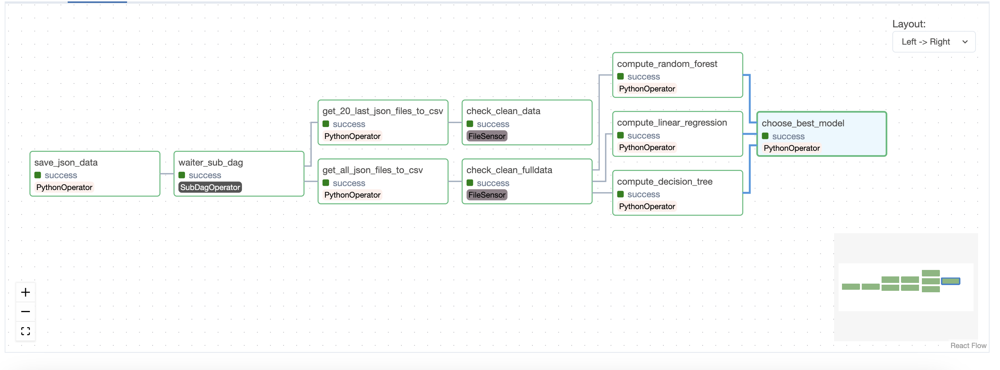

# Machine Learning Workflow with Airflow
> Workflow diagram

<figcaption>Machine Learning Workflow with Airflow</figcaption>

## Description
This project utilizes Apache Airflow to orchestrate a machine learning pipeline. It includes:
- Data preparation
- Saving weather data in JSON format
- Converting data to CSV
- Evaluating different regression models:
    - Linear Regression
    - Decision Tree
    - Random Forests
- Selecting the best model based on their performance obtained through cross-validation.

## Prerequisites
- Python 3.x
- Apache Airflow
- Main Python dependencies: `pandas`, `scikit-learn`

## Installation

1. **Python Environment:** Ensure Python is installed on your system.
   
2. **Apache Airflow:** 
    - First, follow the instructions below to install and configure Apache Airflow on your system. These are extracted from the evaluation guidelines. 

```shell
# shutting down previous containers
docker-compose down 

# deleting previous docker-compose
rm docker-compose.yaml

# downloading new docker-compose.yml file
wget https://dst-de.s3.eu-west-3.amazonaws.com/airflow_avance_fr/eval/docker-compose.yaml

# creating directories
mkdir clean_data
mkdir raw_files

echo -e "AIRFLOW_UID=$(id -u)\nAIRFLOW_GID=0" > .env


docker-compose up airflow-init

wget https://dst-de.s3.eu-west-3.amazonaws.com/airflow_avance_fr/eval/data.csv -O clean_data/data.csv

echo '[]' >> raw_files/null_file.json

# starting docker-compose
docker-compose up -d

airflow pools set ml_pool 1 "Pool ML airflow"
```
- Define the necessary environment variables for retrieving API data.
    - Rename `dags/helpers/airflow_config.default.json` to `dags/helpers/airflow_config.json`.
    - Modify `dags/helpers/airflow_config.json` with the necessary information.

## Project Structure
- **dags/**: Contains the DAG file for the machine learning pipeline.
- **raw_files/**: Folder for storing raw retrieved data.
- **clean_datas/**: Folder for storing cleaned data and the best model.
- **dags/helpers/**: Python scripts for data preparation, model training, etc.
- **raw_files/**: Folder for storing raw retrieved data.
- **clean_datas/**: Folder for storing cleaned data and the best model.

## DAG Configuration
The DAG, named `dag_openweather`, is configured to run every minute. You can modify the schedule and other default parameters as per your requirements.

The `dag_openweather` DAG also includes a subdag named [waiter_sub_dag](./dags/dag_openweather.py#L56) which delays the execution of tasks 2 and 3.

## DAG Tasks
- **Save Weather Data** :
    - `save_json_data`
- **Transform JSON files to CSV :**   
    - `get_20_last_json_files_to_csv`
    - `get_all_json_files_to_csv`
- **Compute and Evaluate Models :**
    - `compute_linear_regression`
    - `compute_decision_tree`
    - `compute_random_forest`
- **Select Best Model :**
    - `choose_best_model`

## Sensors
- **Check JSON Files:** 
    - `check_min_20_json_files`
- **Check Clean Data Files:**    
    - `check_clean_data`
    - `check_clean_fulldata`

## Execution
To run the workflow:

1. Start the Airflow web interface and scheduler.
2. Activate the DAG named `dag_openweather`.
3. Monitor execution and logs through the web interface.